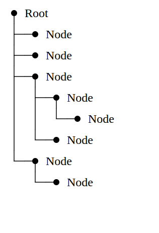

This repo is a Proof-of-Concept of different way to build a tree component using HTML.

A regular tree component on a HTML page is a set of nested tags. This approach does not use nesting of components. Instead, it add a service HTML-block representing line segments connecting tree nodes.
What's benefit of this approach? The lines look neater 🧐

